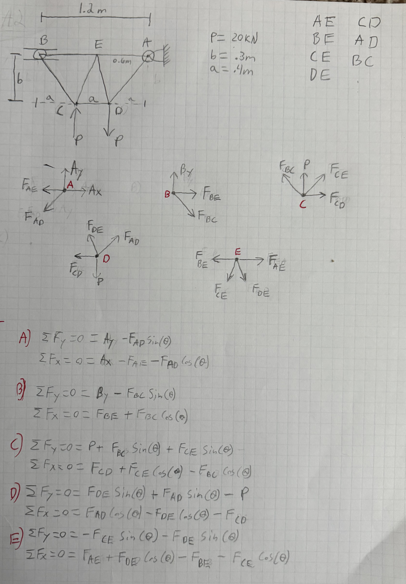
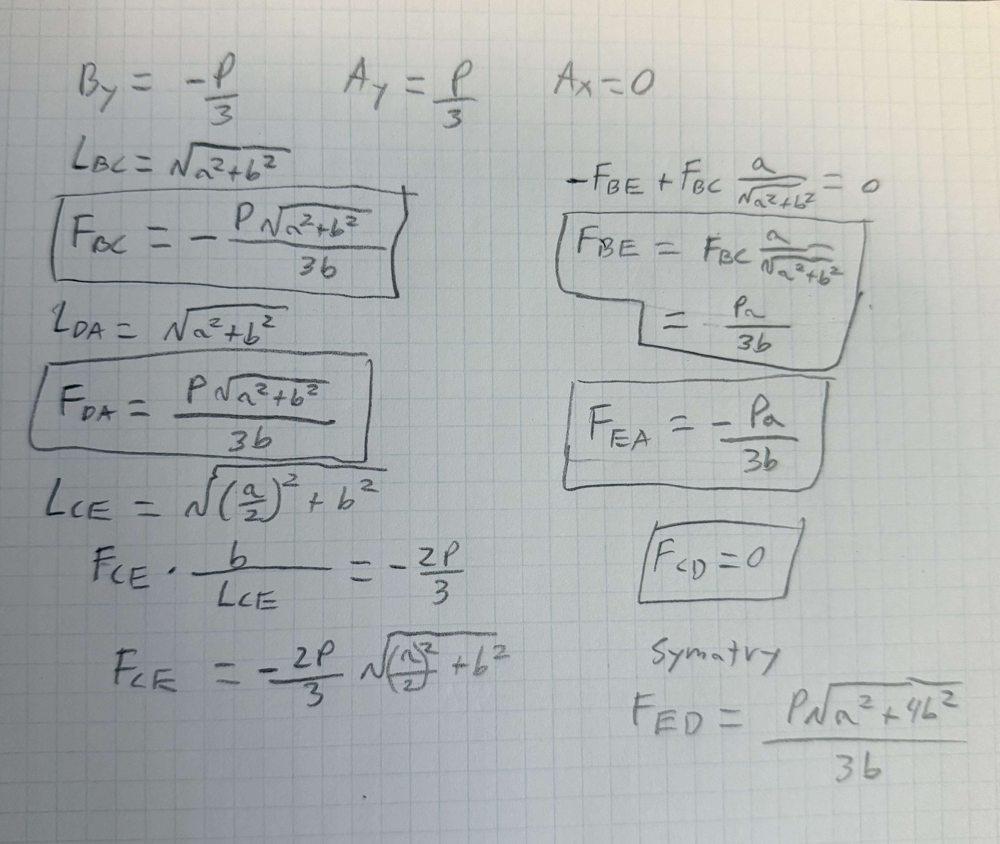
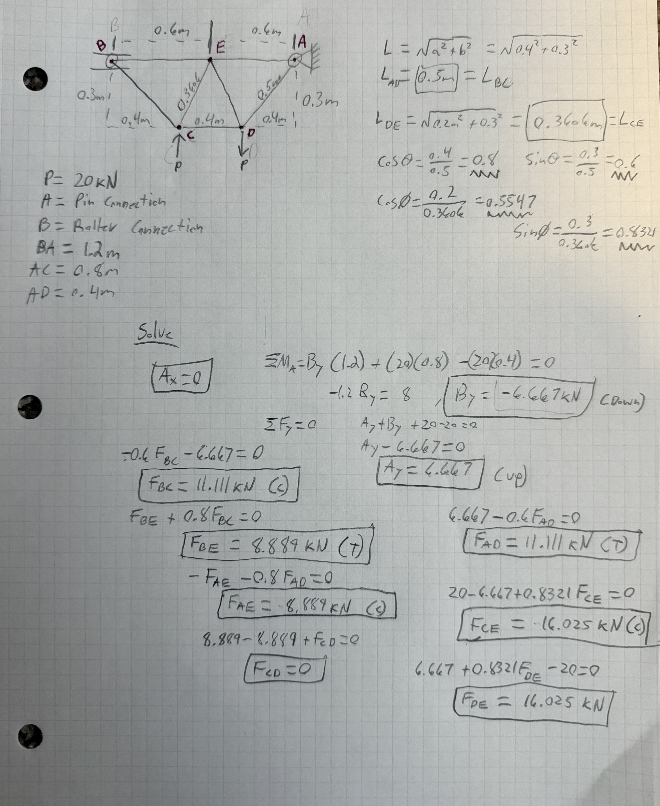
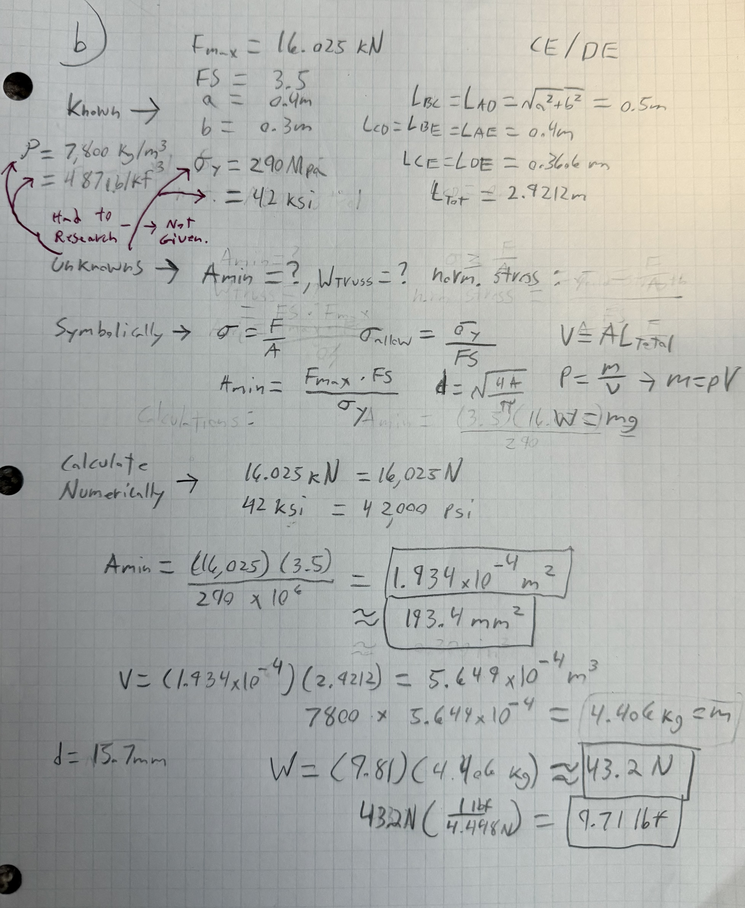
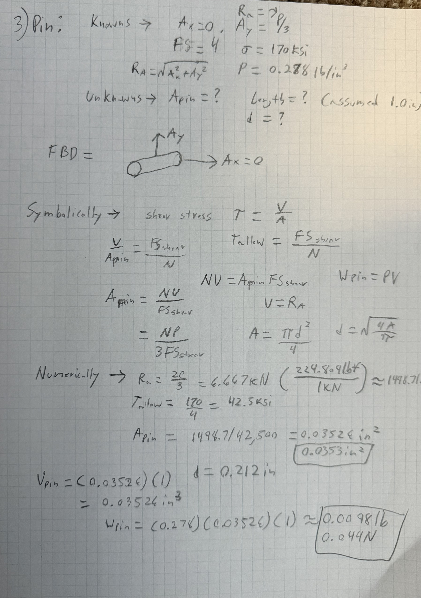

# A2 – Truss Stress Analysis

## Objective
The Objectives for this project are as follows. Design a truss using A500 steel, with free-body diagrams for each joint and the pin using given parameters. Calculate the required cross-sectional area of the truss and pin with a given safety factor. Calculate the best-fitting pin size based on the shear force and safety factor. Show calculations both symbolically and numerically for each step. Estimate the total weight of the truss and pins, then create an accurate CAD model and compare it with the calculations done by hand. Report on the lessons learned during this project.

## Analyze

### Design of Overall Truss Geometry 

  
To start off this project, I began by using the given figure above, where a = 0.4 m, b = 0.3 m, p = 20kN, A is a pin support, and B is a roller support, to sketch my truss. I made the truss as symmetric and simple as I could to keep the calculations easy and the work needed to a minimum. After sketching the truss, I added all external forces and labeled each point of interest for easy reference and listed all knowns as well as the internal force unknowns. Using that, I broke down the truss into its individual joints and sketched them as well. With the sketches complete and all known and unknown variables accounted for, I symbolically solved for all internal forces. All work is shown in the Image below. 

With the sketches, knowns, unknowns, and symbolic calculations written down, I moved on to plugging in the given lengths and forces into a new sketch. To do that, I had to calculate the lengths of each member as well as the sin and cos so that the x and y values of diagonal internal forces could be found. With them, I numerically calculated each internal force as well as reaction forces, using equilibrium equations learned in Statics. 

 With the internal forces and reaction forces found, I could move on to using the largest internal force, 16.025kN, to calculate the minimum cross-sectional area and weight of the truss using a safety factor of 3.5, yield strength of 290Mpa, and density of 7,800kg/m^3. The safety factor was given, but I had to research the yield strength as well as the density of A500 steel. Once done, I listed all knowns and unknowns for easy reference and proceeded to solve symbolically, then numerically. 

### Design of Overall Pin Geometry 
The pin support at A needed a pin designed as it has to hold up to the stresses applied. Just like the truss, I found the cross-sectional area of the pin, which is made of hardened tool steel. It has a yield shear strength of 170ksi, a density of 0.278lb/in^3, and a safety factor of 4. With this information as well as what I had previously found, the reaction force at A, and a drawn FBD sketch of the pin, I could begin to solve symbolically for the minimum cross-sectional area and weight of the pin. 

  

## Decide
_Which geometry did you select, and why? This is your first open design choice in the course — defend it._

## Communicate

