# A3 – [Topic]

## Objective
The objective of assignment A03 is to use parametric and finite element analysis to design a bars dimensions. I'll learn to properly link dimensions in cad as well as compare and contrast the different analysis. 

## Analyze
To start off this assignment, I had to find the design requirements. I was given F=500lbf, E=8.5e^6psi, max axial deflection = 0.009in, and the material is Aluminum. With that, I calculated by hand the length, diameter, and cross sectional area of the bar using the direct tension elongation equation from the Machinery's Handbook. 
  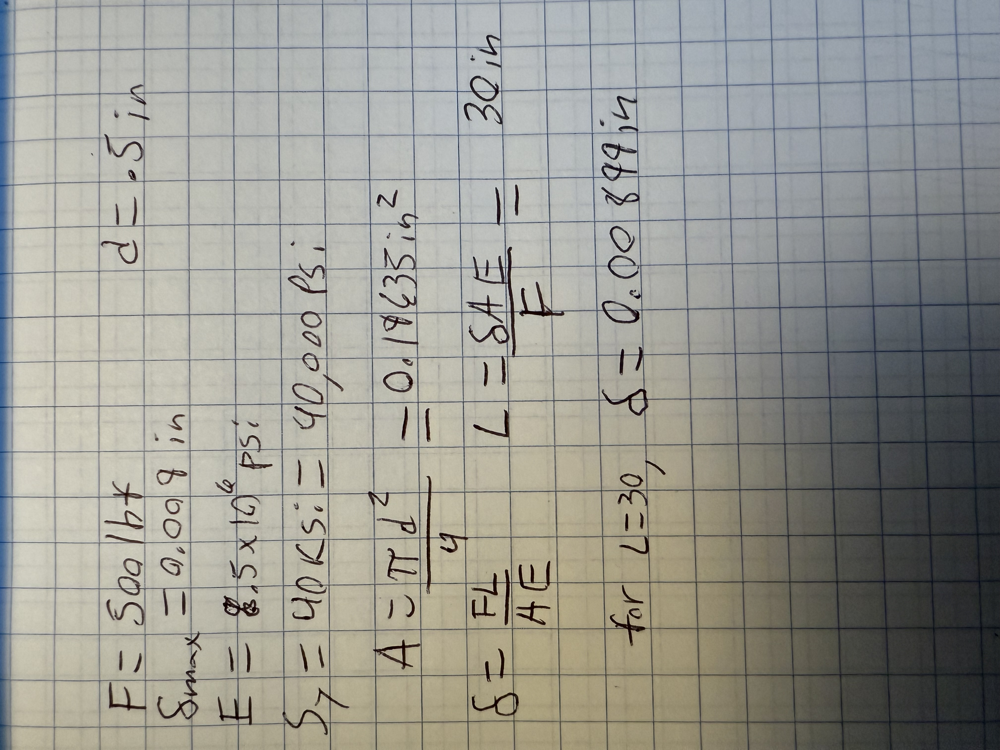

Once I had my parameters outlined, I moved onto making the cad model. To start, I opened a new part in SolidWorks, then in equations I listed the parameters: Force, Diameter, Length, E, MaxDeflection, and Area as well as their corresponding value or equation previously found.
  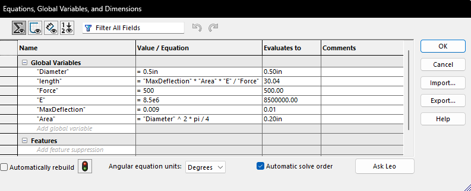
  
The area was rounded to 0.2in^2, while I myself rounded down to 30in in my work shown which was reversed in the SolidWorks equations. 

Using my Equations table, I sketched a circle and set its diameter to 0.5in, then extruded it to 30in.
  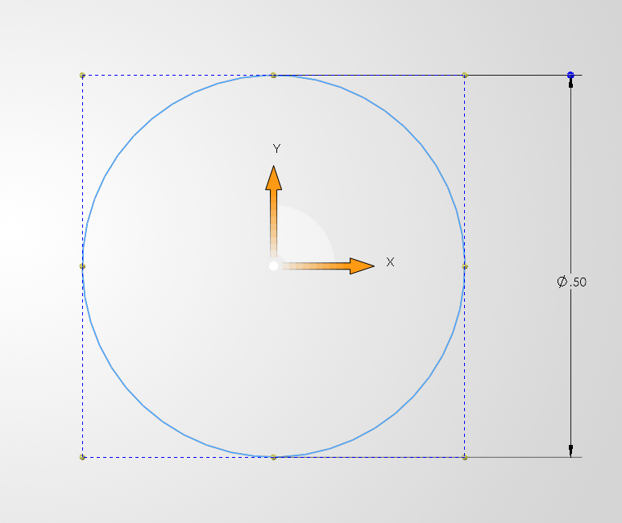
  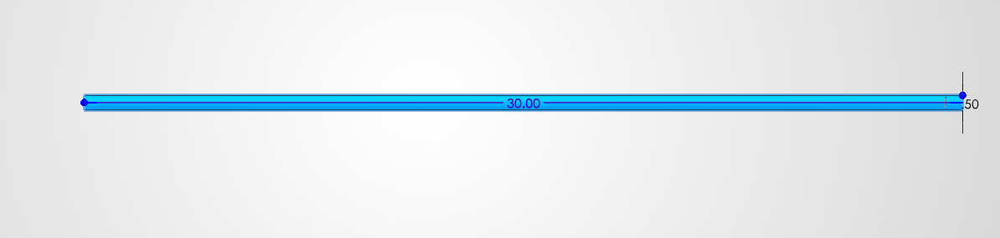

With the bar generated, I applied my custom material Aluminum. To do this, I copied and pasted an existing aluminum alloy, then deleted all its values and inserted my own as shown:
 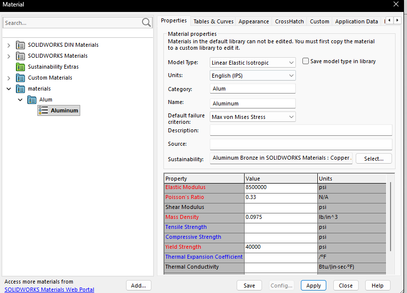

Now done with designing and building the bar, I setup a simulation to run a FEA with the 500lbf used to create the bars dimensions. To do this, one side of the bar was fixed in place, then the other end had the load applied, directed out from the bar. finally, a mesh was added to the bar:
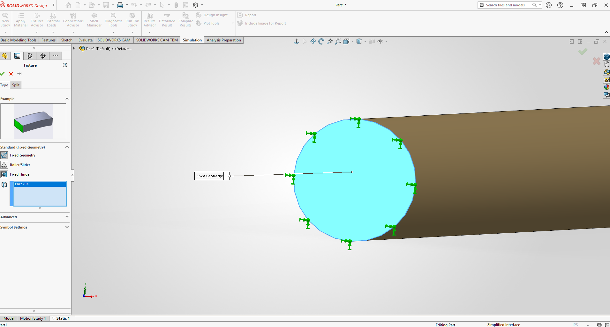
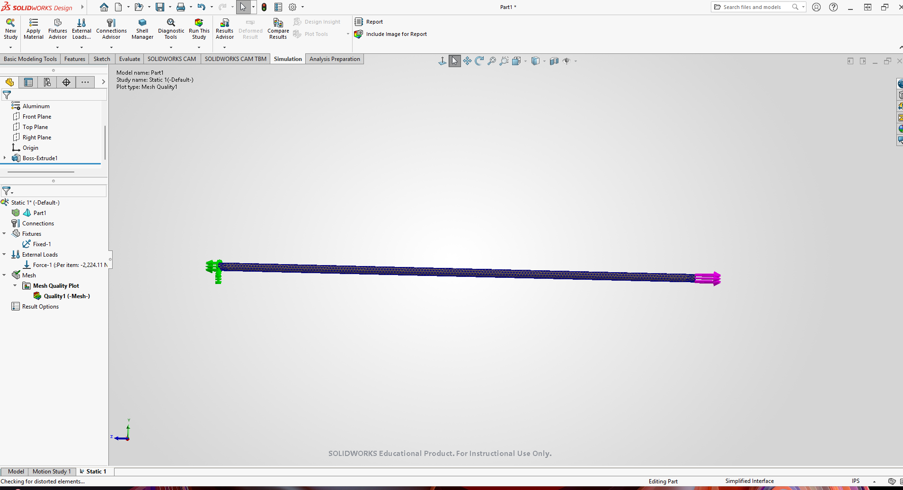

With this setup, I ran the simulation and generated a deflection map as well as a Von Mises Stress map. Using these, I checked if the maximum stress was lower than the strength of my material, aluminum, which is absolutely was. I then used that maximum stress number and aluminum's yield strength to calculate the safety factor which came to a staggering 14.3.
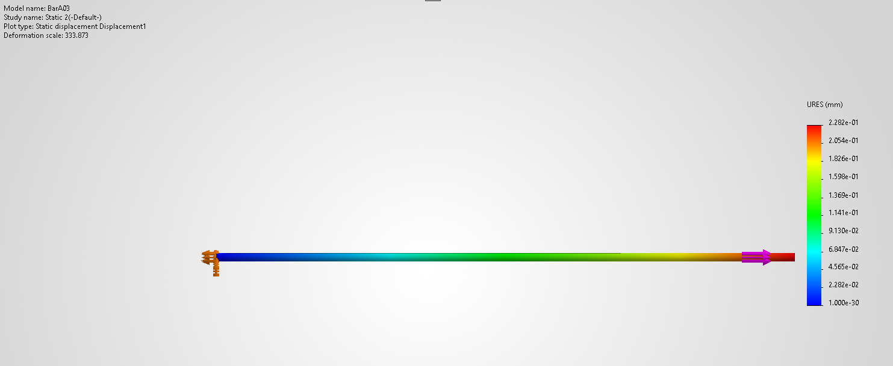
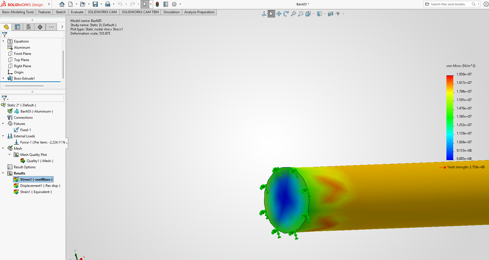
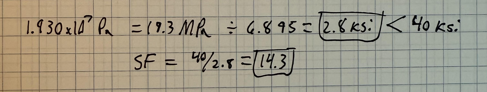

The axial deflection from my hand calculations was 0.00899in, while the FEA predicted an axial deflection of 0.008984in. The percent difference between the two results is 0.18%. The results are essentially the same because the bar has a simple geometry and is primarily subjected to axial loading. The cross-section is relatively uniform, so the hand calculation closely match the conditions modeled in the FEA. For this design, I would trust the FEA result more because FEA accounts for the actual geometry, loading, and boundary conditions of the model, whereas the hand calculation relies on simplifying assumptions. However, the very small difference between the two results provides confidence that both methods are accurate for this simple loading case.
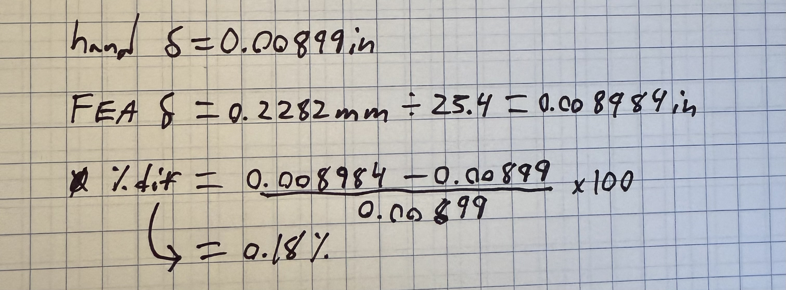

[Download the SolidWorks Part](BarA03.SLDPRT)

During this assignment, I learned how to run a FEA on a part built in SolidWorks, and that you have to assign a material not only in the parts tree, but also on the simulation tab. Using the FEA, I learned how to read stress and displacement maps as well as how to use them. I spent a total of 2hr and 48min on reading the assignment, completing it, and uploading it here as well as canvas. 

