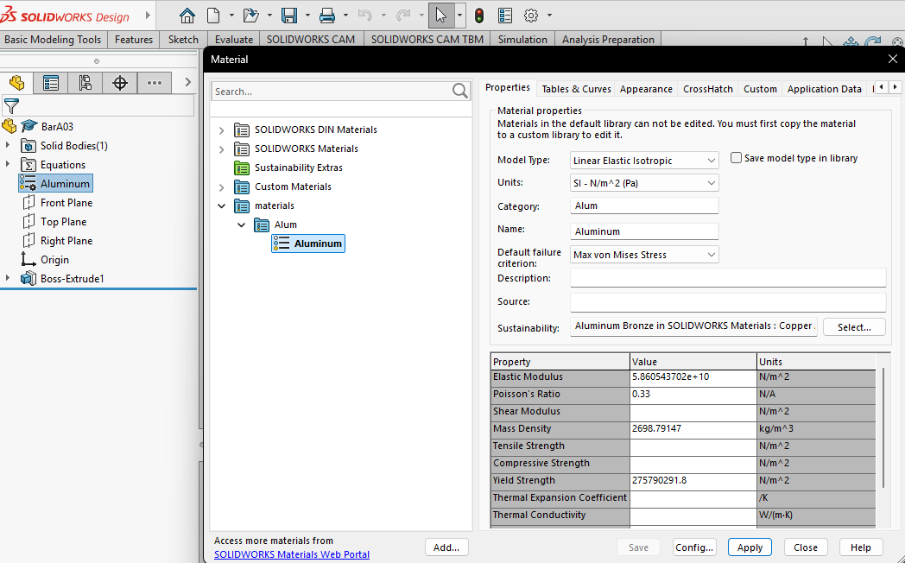

# A3 – [Topic]

## Objective
The objective of assignment A03 is to use parametric and finite element analysis to design a bars dimensions. I'll learn to properly link dimensions in cad as well as compare and contrast the different analysis. 

## Analyze
To start off this assignment, I had to find the design requirements. I was given F=500lbf, E=8.5e^6psi, max axial deflection = 0.009in, and the material is Aluminum. With that, I calculated by hand the length, diameter, and cross sectional area of the bar using the direct tension elongation equation from the Machinery's Handbook. 
  

Once I had my parameters outlined, I moved onto making the cad model. To start, I opened a new part in SolidWorks, then in equations I listed the parameters: Force, Diameter, Length, E, MaxDeflection, and Area as well as their corresponding value or equation previously found.
  
  
The area was rounded to 0.2in^2, while I myself rounded down to 30in in my work shown which was reversed in the SolidWorks equations. 

Using my Equations table, I sketched a circle and set its diameter to 0.5in, then extruded it to 30in.
  
  

With the bar generated, I applied my custom material Aluminum. To do this, I copied and pasted an existing aluminum alloy, then deleted all its values and inserted my own as shown:
 

Now done with designing and building the bar, I conducted a FEA with the 500lbf used to create the bars dimensions. One side of the bar was fixed in place, then the other had the load applied, directed out from the bar. 

 

 

## Decide

## Communicate

