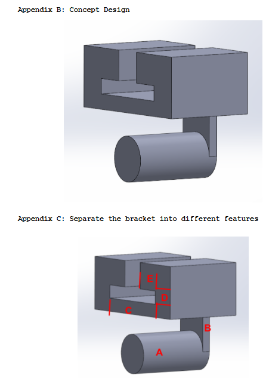

# A5 – Bracket Design

 
  

## Objective
Design and determine the minimum required dimensions of the bracket features A-E so that the bracket can safely support the specified applied load. The design will be evaluated for both strength and stiffness using a factor of safety of 4 and a maximum allowable deflection of 0.005 in. Stress and deflection analyses will be performed for each applicable feature, and the governing dimensions will be used for the final bracket design. 

## Analyze

## Decide

## Communicate

