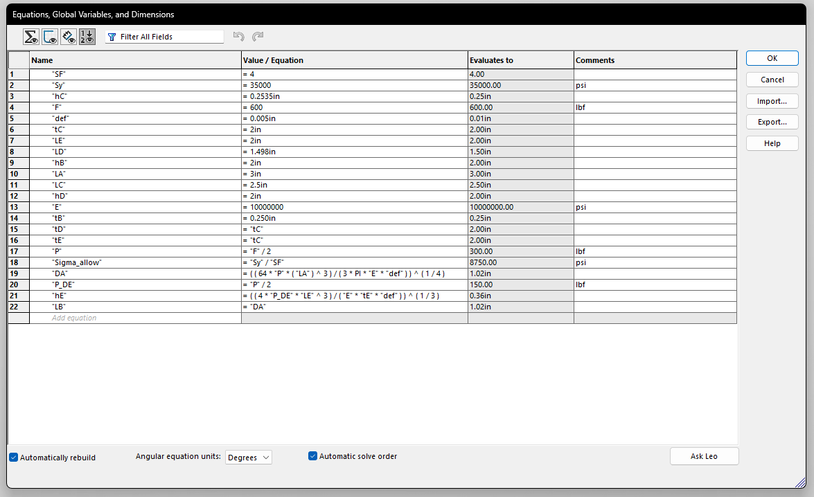
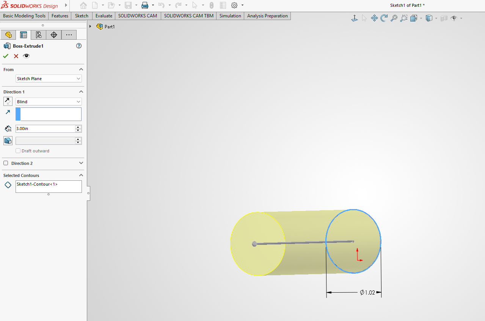
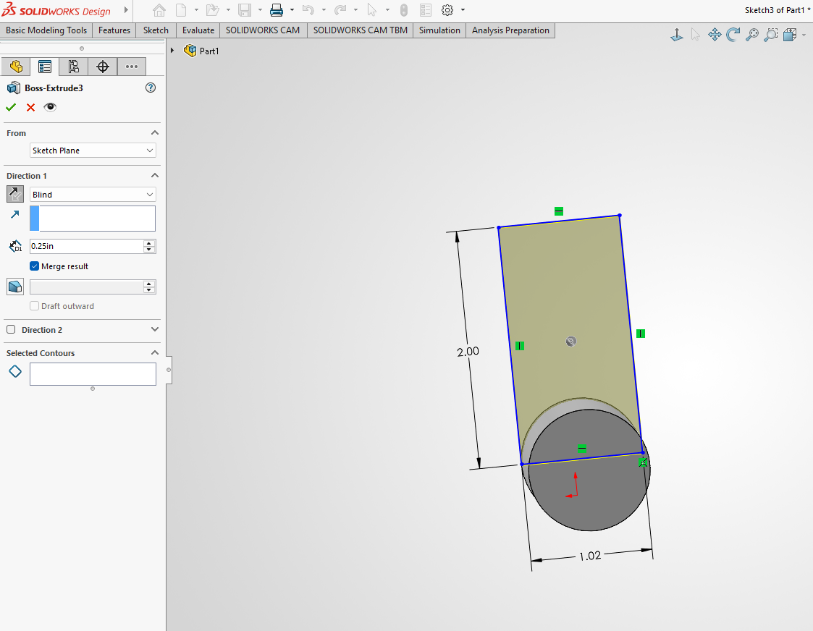
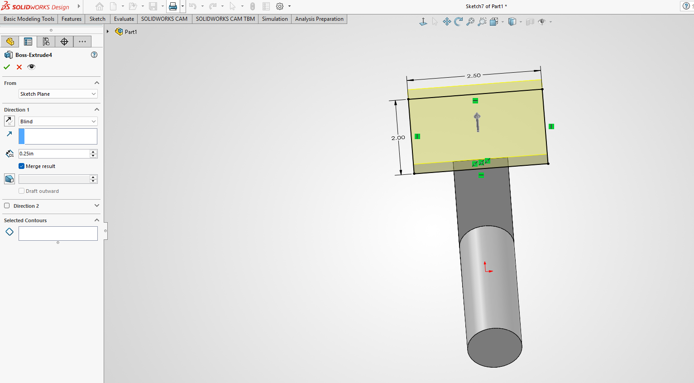
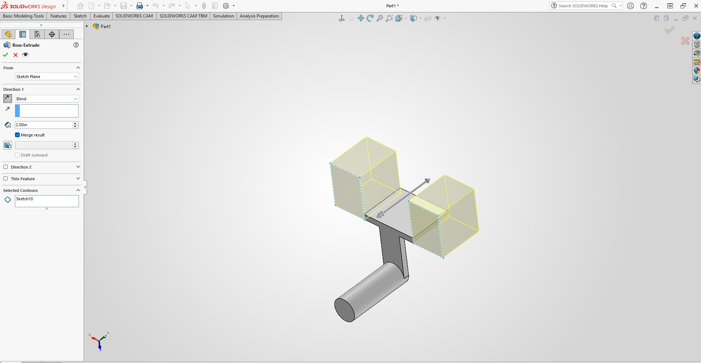
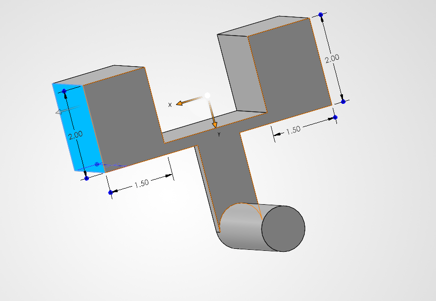
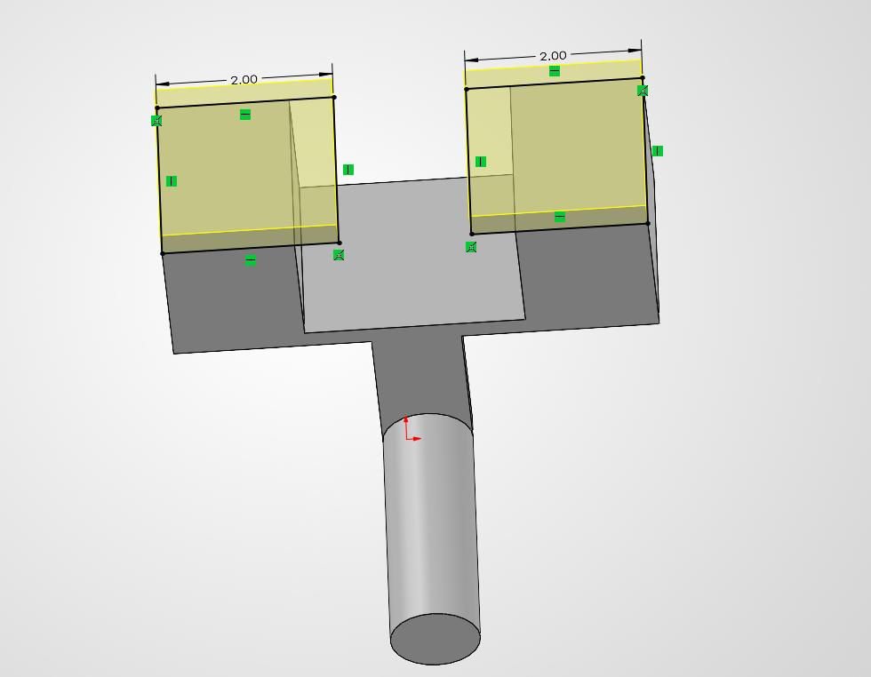
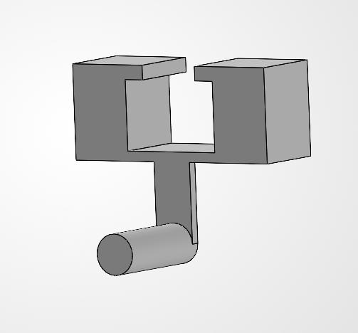
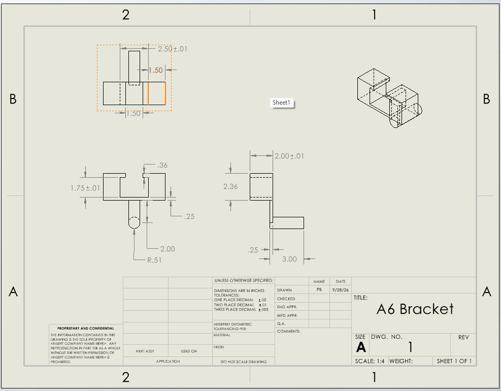

# A6 – [Bracket Drawing]

## Objective

  The objective of A6 was to take the features designed in A5 and create a parametric CAD model. Then, use that model to create a fully dimensioned multiview drawing with engineered tolerances. 

## Design and Drawing

###Parametric Equations List

  Using my numbers gotten from A5, I created an equation list in SolidWorks with the dimensions of features a-e in the Global Variables. This  will allow me to link the dimensions of the model to these variables, thus allowing easy scaling of the model as needed. Units were included in comments for easy reference. 

### Feature a

  With the equation table set up, I began modelling feature a. To do this, I sketched a circle, set its diameter to the global variable "DA", and then extruded it to "LA". I began with this feature for no specific reason other than its labled a. Below is the feature.

### Feature b

  Starting from one flat side of feature a, I sketched a rectangle up from the midpoint. The dimensions were set to "hB" for height, "tB" for thickness, and "LB" for length, which purposefully matched the diameter of feature a, linking them.

### Feature c

  On top of feature b, I sketched another rectangle. I linked the midpoints of the two features to keep them in the correct place as they change. Then, I set the length "LC" and thickness "tC", extruding the result to height "hC"

### Feature d

  For feature d, I continued my process of sketching a rectangle, this time setting the length to "LD" and height to "hD". Extruding to the global variable for thickness, which matches feature c's, "tD". 

### Feature e

  Feature e was given the dimension "LE" for length, linking the outer corners, creating the bracket. I set the thickness to "tE" and extruded up to "hE." That links to the formula that uses my set global variables to automatically calculate the desired height. 

### Final Parametric CAD Model - Downloadable

  Below is my completed part and its CAD file. The process of actually creating the part was much less straightforward than the process described for each feature. While it truly is that simple, I am new to SolidWorks and kept messing up the linking and sketches. 

[Download the SolidWorks Part](A6.SLDPRT)

### Third Angle Multiview Drawing - Downloadable

  To start, I opened my part and made a drawing. Then, I selected the front view and placed a drawing in the bottom-left corner. Using SolidWorks help, I laid out the side, top, and 3d view. Using Smart Dimension, I set all the feature dimensions so the part could be manufactured, including the tolerances for the gap. Those not specified were documented in the tolerance block. 

[Download the SolidWorks Part](A6D.SLDDRW)

## Reflections

